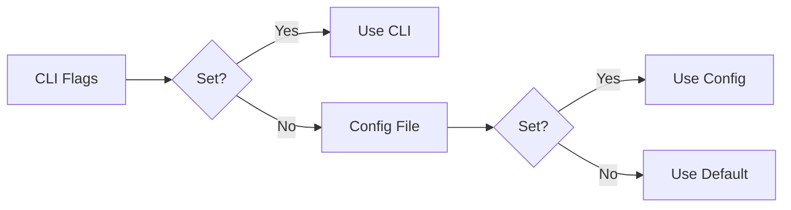

# Configuration Reference

Complete guide to configuring Marimushka.

## Table of Contents

- [Configuration Methods](#configuration-methods)
- [Configuration Precedence](#configuration-precedence)
- [Configuration File](#configuration-file)
- [CLI Options](#cli-options)
- [Environment Variables](#environment-variables)
- [Validation and Errors](#validation-and-errors)
- [Migration Guide](#migration-guide)
- [Examples](#examples)

---

## Configuration Methods

Marimushka can be configured in three ways:

1. **CLI Flags** - Highest priority, per-command customization
2. **Configuration File** - `.marimushka.toml` in project root
3. **Defaults** - Sensible defaults built into the tool

---

## Configuration Precedence

When the same option is specified in multiple places, this is the order of precedence:

```
CLI Flags > Configuration File > Defaults
```

**Example**:
```bash
# Config file (.marimushka.toml)
[marimushka]
max_workers = 4

# CLI overrides config file
uvx marimushka export --max-workers 8
# Uses: 8 (from CLI, not config file)
```

**Visual Flow**:


---

## Configuration File

### File Location

```
project-root/
├── .marimushka.toml  ← Configuration file (optional)
├── notebooks/
├── apps/
└── ...
```

Marimushka looks for `.marimushka.toml` in the current working directory.

### File Format (TOML)

```toml
# .marimushka.toml

[marimushka]
# Output directory for exported files
output = "_site"

# Directory containing static notebooks
notebooks = "notebooks"

# Directory containing apps (run mode, code hidden)
apps = "apps"

# Directory containing interactive notebooks (edit mode)
notebooks_wasm = "notebooks_wasm"

# Custom template path (optional)
template = "templates/custom.html.j2"

# Use sandbox mode for exports (recommended)
sandbox = true

# Enable parallel export
parallel = true

# Number of parallel workers (1-16)
max_workers = 4

# Export timeout in seconds
timeout = 300

[marimushka.security]
# Enable audit logging
audit_enabled = true

# Audit log file path
audit_log = ".marimushka-audit.log"

# Maximum notebook file size in MB
max_file_size_mb = 10

# File permissions for exported files (octal notation)
file_permissions = "0o644"
```

### Creating Configuration File

```bash
# Copy example
cp .marimushka.toml.example .marimushka.toml

# Edit with your values
nano .marimushka.toml  # or vim, code, etc.
```

---

## CLI Options

Complete reference for all CLI flags.

### `marimushka export` Command

#### Output Options

**`--output, -o`**
- **Type**: String (path)
- **Default**: `"_site"`
- **Description**: Output directory for exported files
- **Example**:
  ```bash
  uvx marimushka export --output public
  uvx marimushka export -o dist
  ```

**`--template, -t`**
- **Type**: String (path)
- **Default**: Built-in Tailwind template
- **Description**: Path to custom Jinja2 template file
- **Example**:
  ```bash
  uvx marimushka export --template templates/custom.html.j2
  ```

#### Notebook Directories

**`--notebooks, -n`**
- **Type**: String (path)
- **Default**: `"notebooks"`
- **Description**: Directory containing static notebooks
- **Example**:
  ```bash
  uvx marimushka export --notebooks docs/notebooks
  uvx marimushka export -n my_notebooks
  ```

**`--apps, -a`**
- **Type**: String (path)
- **Default**: `"apps"`
- **Description**: Directory containing apps (run mode, code hidden)
- **Example**:
  ```bash
  uvx marimushka export --apps my_apps
  ```

**`--notebooks-wasm, -nw`**
- **Type**: String (path)
- **Default**: `"notebooks_wasm"`
- **Description**: Directory containing interactive notebooks (edit mode)
- **Example**:
  ```bash
  uvx marimushka export --notebooks-wasm interactive
  ```

#### Execution Options

**`--sandbox / --no-sandbox`**
- **Type**: Boolean flag
- **Default**: `--sandbox` (enabled)
- **Description**: Enable/disable sandbox mode for exports
- **Example**:
  ```bash
  uvx marimushka export --sandbox     # Enabled (default)
  uvx marimushka export --no-sandbox  # Disabled
  ```
- **Recommendation**: Always use `--sandbox` in production

**`--parallel / --no-parallel`**
- **Type**: Boolean flag
- **Default**: `--parallel` (enabled)
- **Description**: Enable/disable parallel export
- **Example**:
  ```bash
  uvx marimushka export --parallel     # Enabled (default)
  uvx marimushka export --no-parallel  # Disabled
  ```

**`--max-workers, -w`**
- **Type**: Integer
- **Default**: `4`
- **Range**: 1-16
- **Description**: Number of parallel workers
- **Example**:
  ```bash
  uvx marimushka export --max-workers 8
  uvx marimushka export -w 2
  ```
- **Performance**: Higher values = faster export (up to CPU count)

**`--bin-path`**
- **Type**: String (path)
- **Default**: `None` (auto-detect)
- **Description**: Custom path to directory containing `uvx` executable
- **Example**:
  ```bash
  uvx marimushka export --bin-path /usr/local/bin
  ```

### `marimushka watch` Command

Same options as `export`, plus automatic re-export on file changes.

**Example**:
```bash
uvx marimushka watch --notebooks notebooks --apps apps
```

**Requires**: `watchfiles` package
```bash
uv add marimushka[watch]
```

### `marimushka version` Command

No options. Shows version information.

```bash
uvx marimushka version
# Output: marimushka 0.2.3
```

---

## Environment Variables

Marimushka supports these environment variables:

### `MARIMUSHKA_LOG_LEVEL`

**Purpose**: Set logging verbosity

**Values**:
- `DEBUG` - Detailed debug information
- `INFO` - General information (default)
- `WARNING` - Warnings only
- `ERROR` - Errors only

**Example**:
```bash
export MARIMUSHKA_LOG_LEVEL=DEBUG
uvx marimushka export
```

### `MARIMUSHKA_TIMEOUT`

**Purpose**: Override default export timeout

**Type**: Integer (seconds)

**Default**: 300 (5 minutes)

**Example**:
```bash
export MARIMUSHKA_TIMEOUT=600
uvx marimushka export
```

**Use case**: Long-running notebooks

### `MARIMUSHKA_CONFIG`

**Purpose**: Specify custom config file path

**Type**: String (path)

**Default**: `.marimushka.toml`

**Example**:
```bash
export MARIMUSHKA_CONFIG=configs/production.toml
uvx marimushka export
```

### Using in Scripts

```bash
#!/bin/bash

# Set environment for export
export MARIMUSHKA_LOG_LEVEL=INFO
export MARIMUSHKA_TIMEOUT=600

# Run export
uvx marimushka export --parallel --max-workers 8
```

---

## Validation and Errors

### Configuration Validation

Marimushka validates all configuration values before exporting.

#### Value Ranges

| Option | Valid Range | Error if Invalid |
|--------|-------------|------------------|
| `max_workers` | 1-16 | `ValueError: max_workers must be between 1 and 16, got {value}` |
| `timeout` | > 0 | `ValueError: timeout must be positive, got {value}` |
| `max_file_size_mb` | > 0 | `ValueError: max_file_size_mb must be positive, got {value}` |

#### Path Validation

**Error**: `FileNotFoundError`
```
Template file not found: /path/to/template.html.j2
Please check the path and try again.
```

**Solution**: Verify file exists
```bash
ls -la templates/custom.html.j2
```

**Error**: `ValueError`
```
Path is not a file: /path/to/directory
```

**Solution**: Provide file path, not directory

#### Type Validation

**Error**: `TypeError`
```
Expected str, got int for 'output'
```

**Solution**: Use correct type
```bash
# ❌ Wrong
uvx marimushka export --output 123

# ✅ Correct
uvx marimushka export --output "_site"
```

#### TOML Syntax Errors

**Error**: `tomli.TOMLDecodeError`
```
Invalid TOML syntax in .marimushka.toml at line 5
```

**Solution**: Fix TOML syntax
```bash
# Validate TOML
python -c "import tomli; tomli.load(open('.marimushka.toml', 'rb'))"
```

Common TOML mistakes:
```toml
# ❌ Wrong: Missing quotes
output = _site

# ✅ Correct: Quoted string
output = "_site"

# ❌ Wrong: Wrong section name
[config]
output = "_site"

# ✅ Correct: Proper section name
[marimushka]
output = "_site"
```

---

## Migration Guide

### From No Configuration to Configuration File

**Before**:
```bash
# Long CLI command
uvx marimushka export \
  --output public \
  --notebooks docs/notebooks \
  --apps docs/apps \
  --parallel \
  --max-workers 8 \
  --sandbox
```

**After**:
```toml
# .marimushka.toml
[marimushka]
output = "public"
notebooks = "docs/notebooks"
apps = "docs/apps"
parallel = true
max_workers = 8
sandbox = true
```

```bash
# Simple CLI
uvx marimushka export
```

### From 0.1.x to 0.2.x+

**Changes**:
- Sandbox mode now enabled by default
- Configuration file support added

**Migration**:
1. Create `.marimushka.toml` (optional)
2. Add dependency metadata to notebooks:
   ```python
   # /// script
   # dependencies = ["pandas", "matplotlib"]
   # ///
   ```
3. Or disable sandbox: `--no-sandbox`

See: [MIGRATION.md](MIGRATION.md) for detailed version migration

### From Environment Variables to Config File

**Before**:
```bash
export MARIMUSHKA_TIMEOUT=600
export MARIMUSHKA_LOG_LEVEL=DEBUG
uvx marimushka export
```

**After**:
```toml
# .marimushka.toml
[marimushka]
timeout = 600

# Note: LOG_LEVEL still uses environment variable
```

```bash
export MARIMUSHKA_LOG_LEVEL=DEBUG
uvx marimushka export
```

---

## Examples

### Example 1: Simple Project

**Structure**:
```
project/
├── notebooks/
│   ├── intro.py
│   └── tutorial.py
└── _site/  (output)
```

**Config**: Use defaults
```bash
uvx marimushka export
```

### Example 2: Custom Directories

**Structure**:
```
project/
├── docs/
│   ├── guides/  (notebooks)
│   └── tools/   (apps)
└── public/  (output)
```

**Config** (`.marimushka.toml`):
```toml
[marimushka]
output = "public"
notebooks = "docs/guides"
apps = "docs/tools"
```

**Usage**:
```bash
uvx marimushka export
```

### Example 3: Custom Template

**Structure**:
```
project/
├── notebooks/
├── apps/
├── templates/
│   └── corporate.html.j2
└── _site/
```

**Config**:
```toml
[marimushka]
template = "templates/corporate.html.j2"
```

**Usage**:
```bash
uvx marimushka export
```

### Example 4: Performance Tuning

**Scenario**: Large project, fast machine

**Config**:
```toml
[marimushka]
parallel = true
max_workers = 16  # Use more workers
timeout = 600     # Longer timeout
```

**Result**: Faster exports for projects with many notebooks

### Example 5: CI/CD Configuration

**Scenario**: Automated builds

**Config**:
```toml
[marimushka]
output = "dist"
sandbox = true      # Always use sandbox in CI
parallel = true
max_workers = 4     # Conservative for CI

[marimushka.security]
audit_enabled = true
audit_log = "ci-audit.log"
```

**GitHub Action**:
```yaml
- uses: jebel-quant/marimushka@v0.2.3
  # Config file used automatically
```

### Example 6: Development vs Production

**Development** (`.marimushka.dev.toml`):
```toml
[marimushka]
output = "_site"
sandbox = false     # Faster iteration
parallel = false    # Easier debugging
max_workers = 1

[marimushka.security]
audit_enabled = false
```

**Production** (`.marimushka.toml`):
```toml
[marimushka]
output = "public"
sandbox = true      # Reproducibility
parallel = true     # Performance
max_workers = 8

[marimushka.security]
audit_enabled = true
audit_log = "prod-audit.log"
max_file_size_mb = 10
```

**Usage**:
```bash
# Development
export MARIMUSHKA_CONFIG=.marimushka.dev.toml
uvx marimushka export

# Production
export MARIMUSHKA_CONFIG=.marimushka.toml
uvx marimushka export
```

### Example 7: Debugging Configuration

**Enable verbose logging**:
```bash
export MARIMUSHKA_LOG_LEVEL=DEBUG
uvx marimushka export
```

**Output includes**:
```
DEBUG | Loading configuration from .marimushka.toml
DEBUG | Config: output='_site', notebooks='notebooks', ...
DEBUG | Found 5 notebooks in notebooks/
DEBUG | Exporting notebook: intro.py
DEBUG | Command: ['uvx', 'marimo', 'export', 'html', '--sandbox', ...]
DEBUG | Export succeeded: intro.py
...
```

---

## Configuration Best Practices

### 1. Use Configuration File for Project Settings

✅ **Do**:
```toml
# .marimushka.toml (committed to repo)
[marimushka]
notebooks = "docs/notebooks"
apps = "docs/apps"
output = "_site"
```

❌ **Don't**:
```bash
# Long CLI command every time
uvx marimushka export --notebooks docs/notebooks --apps docs/apps
```

### 2. Use CLI Flags for Overrides

```bash
# Config has max_workers = 4
# Override for this run:
uvx marimushka export --max-workers 8
```

### 3. Always Use Sandbox in Production

```toml
[marimushka]
sandbox = true  # ✅ Reproducibility
```

### 4. Enable Audit Logging in Production

```toml
[marimushka.security]
audit_enabled = true
audit_log = ".marimushka-audit.log"
```

### 5. Keep Config File Simple

```toml
# ✅ Good: Only what you need
[marimushka]
output = "public"
notebooks = "docs"

# ❌ Bad: Everything, even defaults
[marimushka]
output = "_site"
notebooks = "notebooks"
apps = "apps"
notebooks_wasm = "notebooks_wasm"
sandbox = true
parallel = true
max_workers = 4
timeout = 300
# ... (30 more lines)
```

### 6. Document Custom Settings

```toml
# .marimushka.toml

# Using custom template for corporate branding
[marimushka]
template = "templates/corporate.html.j2"

# Higher timeout for notebooks with heavy computations
timeout = 600
```

---

## Troubleshooting Configuration

### Problem: Config file not being used

**Check**:
```bash
# Must be in current directory
ls -la .marimushka.toml

# Or specify path
export MARIMUSHKA_CONFIG=path/to/config.toml
```

### Problem: CLI flag not working

**Remember precedence**:
```bash
# CLI overrides config file
uvx marimushka export --max-workers 8
# Uses 8, even if config says 4
```

### Problem: Invalid TOML syntax

**Validate**:
```bash
python -c "import tomli; print(tomli.load(open('.marimushka.toml', 'rb')))"
```

**Common mistakes**:
- Missing quotes around strings
- Wrong section names
- Typos in option names

---

## Complete Configuration Reference Table

| Option | Type | Default | Range | Description |
|--------|------|---------|-------|-------------|
| **Main Options** |
| `output` | string | `"_site"` | - | Output directory |
| `template` | string | Built-in | - | Template file path |
| `notebooks` | string | `"notebooks"` | - | Static notebooks directory |
| `apps` | string | `"apps"` | - | Apps directory |
| `notebooks_wasm` | string | `"notebooks_wasm"` | - | Interactive notebooks directory |
| **Execution** |
| `sandbox` | boolean | `true` | - | Enable sandbox mode |
| `parallel` | boolean | `true` | - | Enable parallel export |
| `max_workers` | integer | `4` | 1-16 | Number of parallel workers |
| `timeout` | integer | `300` | > 0 | Export timeout (seconds) |
| `bin_path` | string | `null` | - | Custom uvx directory |
| **Security** |
| `security.audit_enabled` | boolean | `true` | - | Enable audit logging |
| `security.audit_log` | string | `.marimushka-audit.log` | - | Audit log file |
| `security.max_file_size_mb` | integer | `10` | > 0 | Max notebook size (MB) |
| `security.file_permissions` | string | `"0o644"` | - | Exported file permissions |

---

## Related Documentation

- **[README.md](README.md#configuration-file)** - Quick configuration guide
- **[API.md](API.md)** - Programmatic configuration
- **[FAQ.md](FAQ.md#configuration)** - Configuration FAQs
- **[MIGRATION.md](MIGRATION.md)** - Version-specific configuration changes
- **[.marimushka.toml.example](.marimushka.toml.example)** - Example configuration file

---

**Last updated**: 2025-01-15  
**Questions?** [Open a discussion](https://github.com/jebel-quant/marimushka/discussions)
