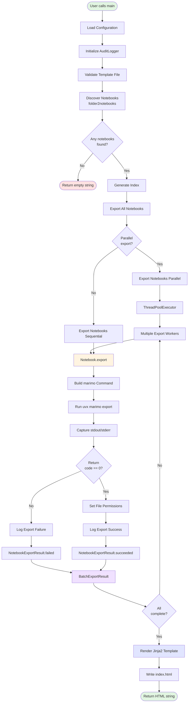
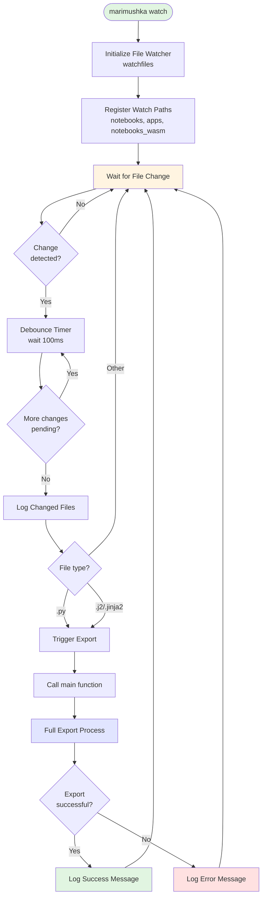
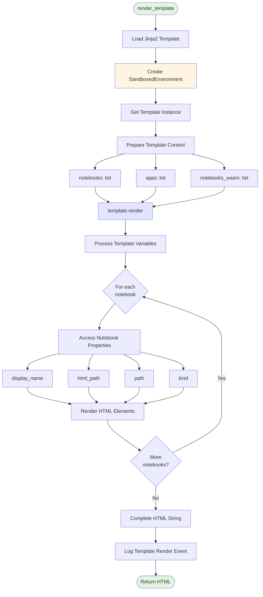
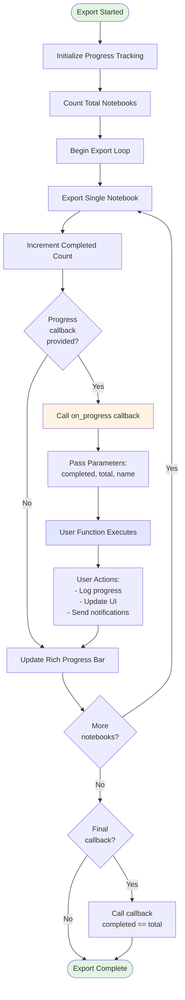
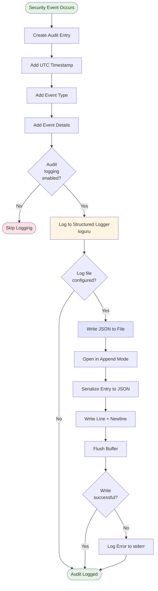
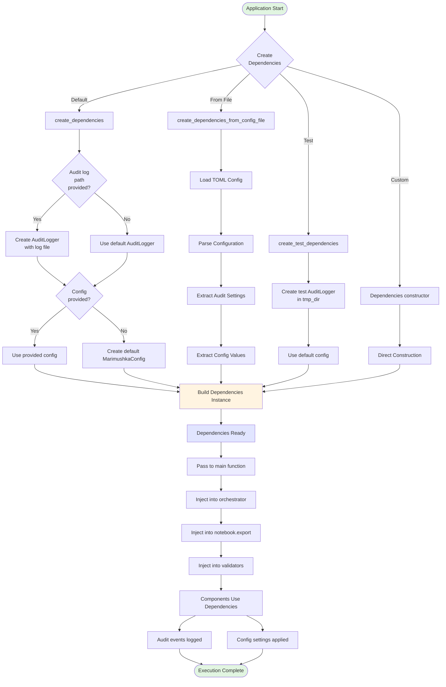

# Data Flow Architecture

This document describes the data flow through the marimushka system using Mermaid diagrams. These diagrams illustrate how data moves between components during various operations.

## Export Process Flow

The main export process handles notebook export from input to HTML output:



## Watch Mode Flow

Watch mode monitors filesystem changes and triggers re-exports:



## Template Rendering Flow

Template rendering processes notebook data into HTML:



## Progress Callback Flow

Progress callbacks notify users of export progress:



## Audit Logging Flow

Audit logging tracks security-relevant events:



## Dependency Injection Flow

Dependency injection provides components with their dependencies:



## Key Data Structures

### NotebookExportResult

```python
@dataclass(frozen=True)
class NotebookExportResult:
    notebook_path: Path      # Input notebook
    success: bool            # Export succeeded?
    output_path: Path | None # HTML output (if success)
    error: ExportError | None # Error details (if failure)
```

### BatchExportResult

```python
@dataclass
class BatchExportResult:
    results: list[NotebookExportResult]  # All results

    @property
    def total(self) -> int               # Count of all
    def succeeded(self) -> int           # Count of successes
    def failed(self) -> int              # Count of failures
    def all_succeeded(self) -> bool      # All successful?
    def failures(self) -> list           # Failed results
    def successes(self) -> list          # Successful results
```

### Dependencies

```python
@dataclass
class Dependencies:
    audit_logger: AuditLogger             # Audit event logger
    config: MarimushkaConfig              # Configuration settings

    def with_audit_logger(...)            # Update audit logger
    def with_config(...)                  # Update config
```

## Performance Characteristics

### Parallel Export

- **Concurrency**: ThreadPoolExecutor with configurable workers (default: 4)
- **Bounded**: Worker count limited to 1-16 for security
- **Non-blocking**: Progress callbacks don't block export threads
- **Error isolation**: Individual notebook failures don't affect others

### Sequential Export

- **Deterministic**: Predictable order for debugging
- **Lower overhead**: No thread pool management
- **Simpler debugging**: Easier to trace execution
- **Progress tracking**: Callbacks in exact notebook order

### Template Rendering

- **Sandboxed**: SandboxedEnvironment prevents code execution
- **Single pass**: All notebooks rendered in one template pass
- **Memory efficient**: Lazy iteration over notebook lists
- **Fast**: Jinja2 optimized rendering

## Error Handling

All flows include error handling at each step:

1. **Validation errors** → TemplateNotFoundError, NotebookInvalidError
2. **Export errors** → ExportSubprocessError, ExportExecutableNotFoundError
3. **Rendering errors** → TemplateRenderError
4. **I/O errors** → IndexWriteError
5. **Security errors** → Caught and sanitized before logging

Each error is:
- Logged with sanitized paths
- Captured in audit log
- Included in result objects
- Propagated with context
